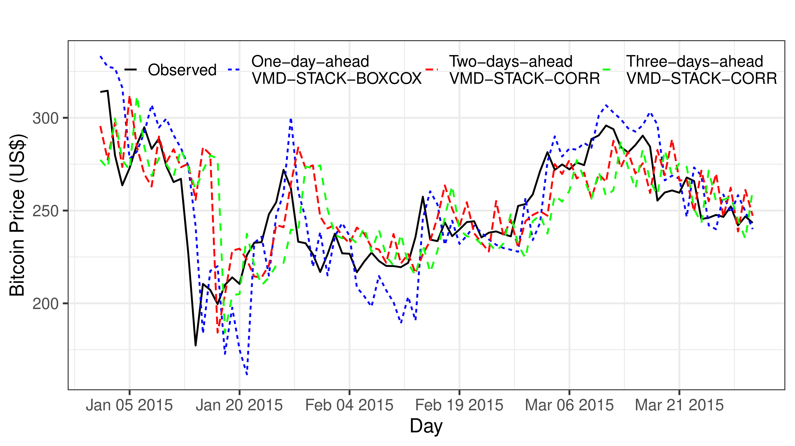
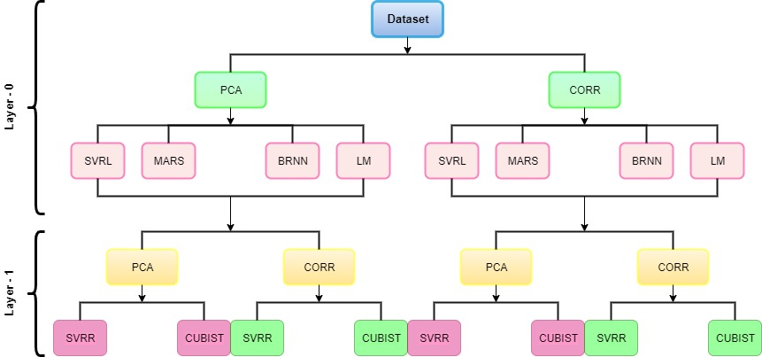

# Publications in 2020 IEEE World Congress on Computational Intelligence (WCCI) | 2020 International Joint Conference on Neural Networks (IJCNN)

## :moneybag: Multi-step ahead Bitcoin price forecasting based on VMD and ensemble learning methods



### Code
- [Bitcoin repository file](Bitcoin/)

### Publication
- [Preprint (ResearchGate)](https://www.researchgate.net/publication/340654637_Multi-step_ahead_Bitcoin_Price_Forecasting_Based_on_VMD_and_Ensemble_Learning_Methods)
- [Conference paper (IEEE *Xplore*)]()

### How to cite this paper
```bibtex
@inproceedings{silva2020multi,
author={da Silva, Ramon Gomes and Ribeiro, Matheus Henrique Dal Molin and Fraccanabbia, Naylene and Mariani, Viviana Cocco and Coelho, Leandro Santos},
booktitle={International Joint Conference on Neural Networks (IJCNN)},
title={Multi-step ahead {Bitcoin} Price Forecasting Based on {VMD} and Ensemble Learning Methods},
year={2020},
pages={1--8},
month={July},
address={Glasgow, Scotland},
doi={}
}
```
----

## :sunny: Solar power forecasting based on ensemble learning methods



### Code
- [Solar power repository file](Solar_Power/)

### Publication
- [Conference paper (IEEE *Xplore*)]()

### How to cite this paper
```bibtex
@inproceedings{fraccanabbia2020solar,
author={Fraccanabbia, Naylene and da Silva, Ramon Gomes and Ribeiro, Matheus Henrique Dal Molin and Moreno, Sinvaldo Rodrigues and Mariani, Viviana Cocco and Coelho, Leandro Santos},
booktitle={International Joint Conference on Neural Networks (IJCNN)},
title={Solar Power Forecasting Based on Ensemble Learning Methods},
year={2020},
pages={1--8},
month={July},
address={Glasgow, Scotland},
doi={}
}
```
